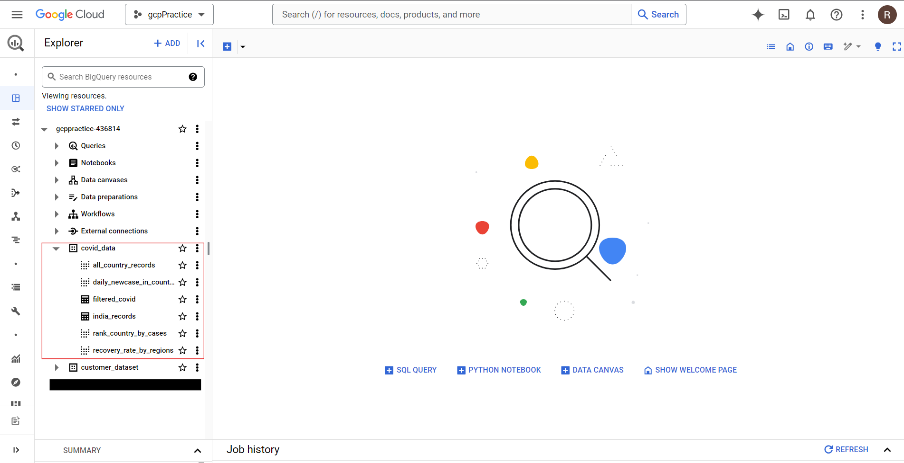

# Dataform COVID-19 Transformations

## Overview
This repository contains SQL transformations built in **Dataform** using public datasets from **Google Cloud's BigQuery**. The primary dataset analyzed is the **COVID-19 Open Data**, which contains global COVID-19 statistics such as confirmed cases, deaths, and recoveries.

The transformations in this repository demonstrate various data operations including filtering, aggregation, joining datasets, and incremental processing to explore and analyze the COVID-19 data.

## Public Datasets Used
1. [COVID-19 Open Data](https://console.cloud.google.com/marketplace/product/bigquery-public-datasets/covid19-open-data)
   - Dataset ID: `bigquery-public-data.covid19_open_data`

## Operations and Transformations

This repository includes examples of the following Dataform SQL operations:
1. **Basic Data Selection**: Selecting key columns like confirmed cases, deaths, and recoveries.
2. **Filtering by Date and Country**: Filtering data for specific countries and time periods.
3. **Aggregating Data**: Summarizing total confirmed cases and deaths by country.
4. **Window Functions**: Ranking countries by number of confirmed cases.
5. **Calculating Daily New Cases**: Using window functions to calculate day-over-day case increases.
6. **Calculating Recovery Rates**: Calculating the recovery rate by dividing recovered cases by confirmed cases.

## Getting Started

### Prerequisites
- **Google Cloud Platform**: Set up a BigQuery project and link it to **Dataform**.
- **Node Js**: set up node.js to install dataform cli.
- **Dataform CLI**: Install the [Dataform CLI](https://docs.dataform.co/guides/getting-started) to execute transformations locally or set up automated runs.

### Running the Transformations
1. Clone the repository:
   ```bash
   git clone https://github.com/YOUR-USERNAME/dataform-covid19-transformations.git
2. Install Dataform dependencies:
   ```bash
   dataform install

3. Modify ```workflow_settings.yaml``` with your Dataform project to point to your BigQuery datasets.

4. Create ```.df-credentials.json``` with your credentials for Google Cloud.

5. Compile the transformation
   ```bash
   dataform compile

6. Run
   ```bash
   dataform run

After all the steps you will see the below output in youe GCP BigQuery.
